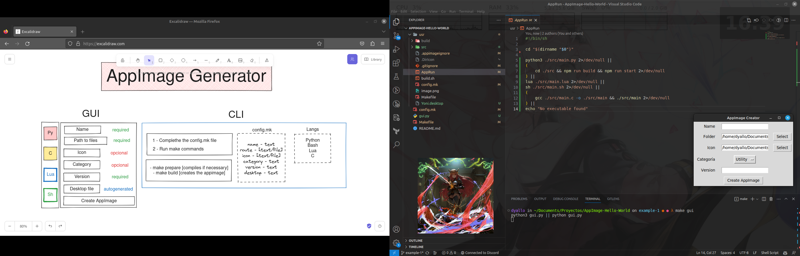
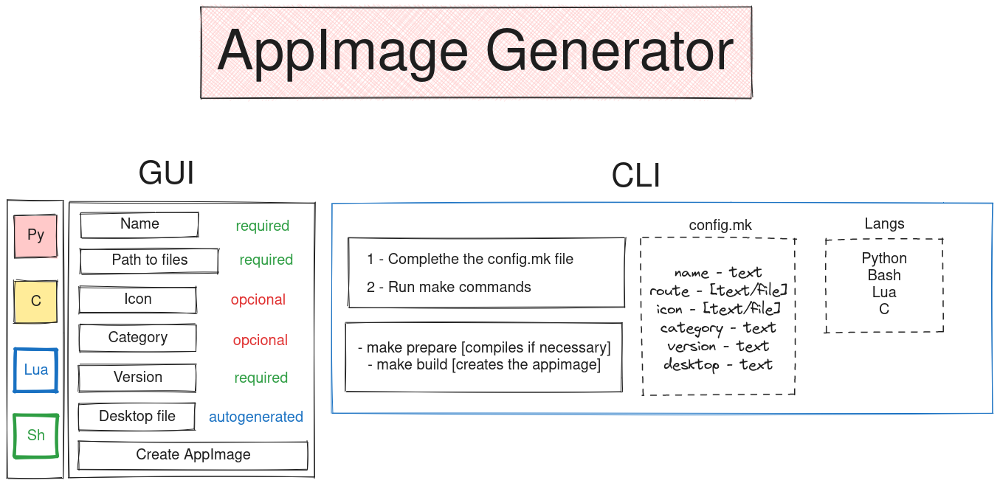

# AppImage Hello-World - GUI📔

This branch is the same as the master branch, but different types of files are used to build the AppImage.

## How it looks 📸



## Requirements 🔨

- curl
- git
- make
- python3
- tkinter

## Clone the repo 📥

```bash
git clone -b gui git@github.com:jd-apprentice/AppImage-Hello-World.git
cd AppImage-Hello-World
```
## Run with GUI 🖥

Requires `python3` and `tkinter` to be installed.

```bash
make gui
```

### Ideas 💡

Work in progress, but here are some ideas:



#### Notes 📝

- When you are selecting a folder remember to enter inside the folder
- For the image icon, use only `.png` files or `.jpg` files
- Supports only C, Python, Node, Lua, Bash
- Whenever you are copying your app it should be inside a `src` folder and the main executable should be named `main.<extension>`

#### TODO - Improvements 📌

- [x] Base idea
- [ ] Handle errors
- [ ] Add more languages
- [ ] Allow to select the language from the gui
- [ ] AppRun has to detect the main executable and allow any file structure